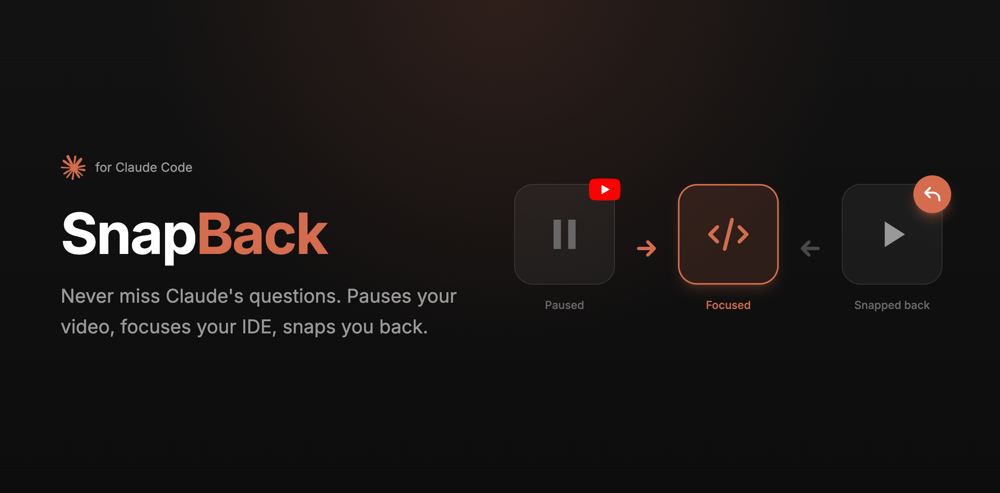

<p align="center">
  
</p>

<p align="center">
  <strong>Attention manager for Claude Code</strong><br>
  Pauses your media, focuses your IDE, snaps you back when done.
</p>

<p align="center">
  <a href="#installation">Installation</a> •
  <a href="#how-it-works">How It Works</a> •
  <a href="#configuration">Configuration</a> •
  <a href="#troubleshooting">Troubleshooting</a>
</p>

<p align="center">
  
  
  
</p>

---

## The Problem

You're watching YouTube while Claude Code works. Claude finishes and asks a question, but you're not paying attention. Minutes pass. Productivity lost.

## The Solution

**SnapBack** hooks into Claude Code and:

1. **Pauses** your browser media (YouTube, etc.)
2. **Plays** a notification sound
3. **Focuses** your IDE and terminal
4. **Returns** you to your video when you respond

No more missed prompts. No more context switching friction.

---

## Installation

```bash
git clone https://github.com/teoobarca/snapback.git
cd snapback
./snapback install
```

The installer will guide you through:
- Configuring your preferred apps and browser
- Setting up Claude Code hooks
- Granting macOS automation permissions

---

## CLI Usage

```bash
snapback install     # Interactive installation
snapback status      # Check if everything is configured
snapback on          # Enable Claude Code hooks
snapback off         # Disable hooks (keeps config)
snapback uninstall   # Remove config and hooks
```

---

## How It Works

```
┌─────────────────┐     ┌─────────────────┐     ┌─────────────────┐
│                 │     │                 │     │                 │
│  YouTube ▶️     │ ──▶ │  IDE (focused)  │ ──▶ │  YouTube ▶️     │
│  (paused)       │     │                 │     │  (resumed)      │
│                 │     │                 │     │                 │
└─────────────────┘     └─────────────────┘     └─────────────────┘
   Claude asks            You respond            Back to video
```

**Triggers:**
- `PermissionRequest` / `Stop` → Pauses media, focuses IDE
- `PostToolUse` / `UserPromptSubmit` → Returns to previous app, resumes media

---

## Configuration

Config file: `~/.config/snapback/config`

| Option | Default | Description |
|--------|---------|-------------|
| `FOCUS_APPS` | `("Cursor" "Ghostty")` | Apps to focus (in order, last stays on top) |
| `FOCUS_DELAY` | `0.5` | Seconds between focusing each app |
| `BROWSER` | `"Google Chrome"` | Browser for media control |
| `SEEK_BACK_SECONDS` | `1` | Rewind when resuming video |
| `THROTTLE_SECONDS` | `2` | Cooldown between triggers |
| `NOTIFICATION_SOUND` | `"default"` | Sound file, `"default"`, or `""` to disable |

---

## Claude Code Hooks

<details>
<summary>Manual hook configuration (if you skipped the installer)</summary>

Add to `~/.claude/settings.json`:

```json
{
  "hooks": {
    "PermissionRequest": [
      {"matcher": "*", "hooks": [{"type": "command", "command": "/path/to/snapback.sh"}]}
    ],
    "Stop": [
      {"hooks": [{"type": "command", "command": "/path/to/snapback.sh"}]}
    ],
    "PostToolUse": [
      {"matcher": "Edit|Write|Bash", "hooks": [{"type": "command", "command": "/path/to/snapback-resume.sh"}]}
    ],
    "UserPromptSubmit": [
      {"hooks": [{"type": "command", "command": "/path/to/snapback-resume.sh"}]}
    ]
  }
}
```

</details>

---

## Known Limitations

> **Note:** These are Claude Code hook limitations, not SnapBack bugs.

- **No decline hook** — If you decline a permission request, SnapBack can't detect it. You'll need to switch back manually.
- **Failed tools don't trigger** — `PostToolUse` only fires on successful tool execution.

---

## Troubleshooting

| Issue | Solution |
|-------|----------|
| Video doesn't pause | Run `./snapback.sh` manually to trigger permission dialogs |
| Permission errors | System Settings → Privacy & Security → Automation |
| Apps not focusing | Increase `FOCUS_DELAY` to `0.7` or `1.0` |
| Too many notifications | Increase `THROTTLE_SECONDS` |
| Check current status | Run `snapback status` |

---

## Requirements

- macOS (uses AppleScript for automation)
- Chromium-based browser (Chrome, Arc, Brave, Edge)
- `jq` (optional, for automatic hook installation)

---

## License

MIT © [teoobarca](https://github.com/teoobarca)
